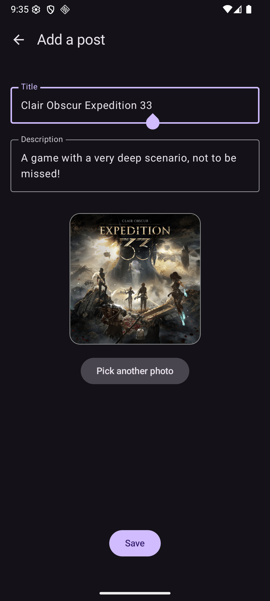
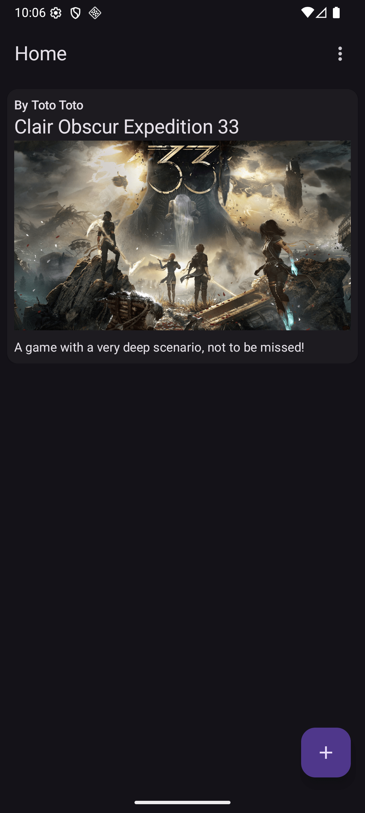
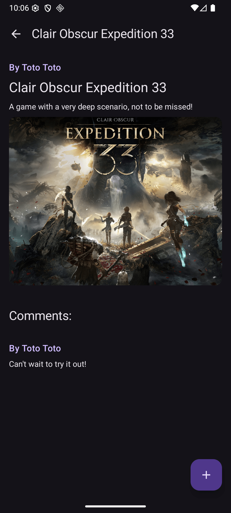
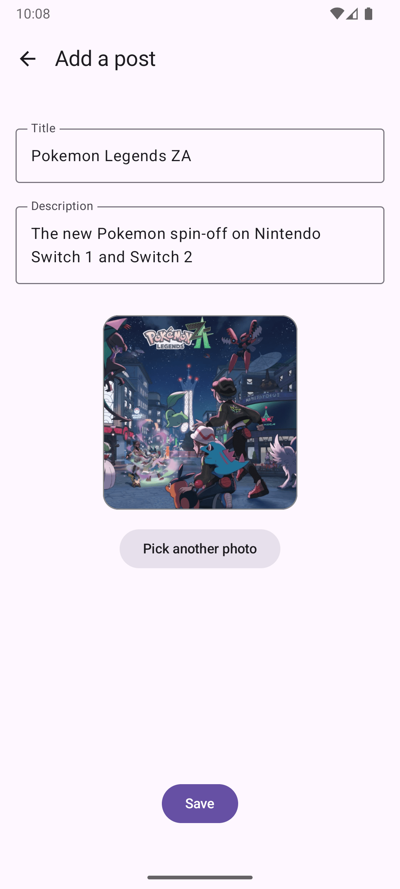
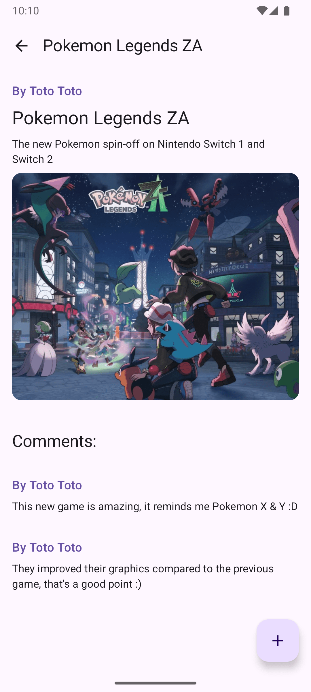
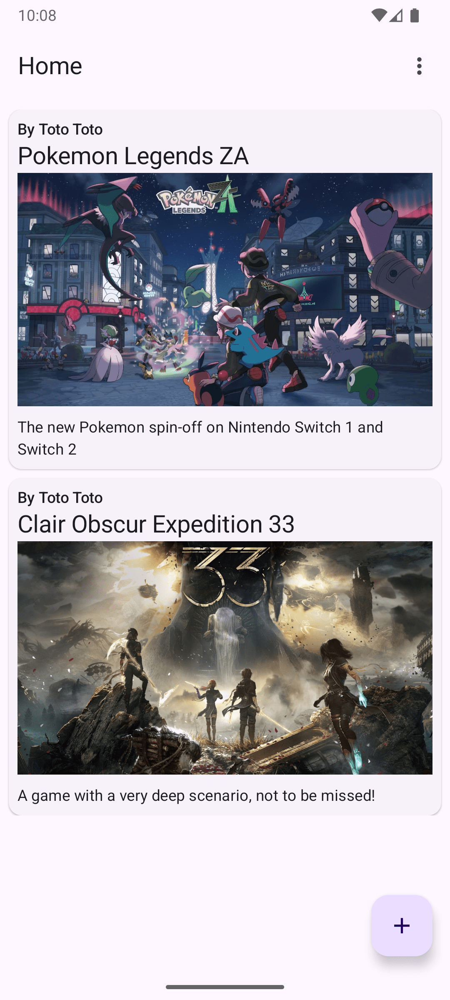
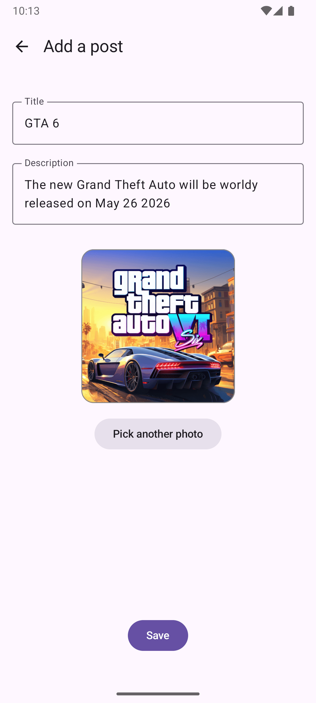
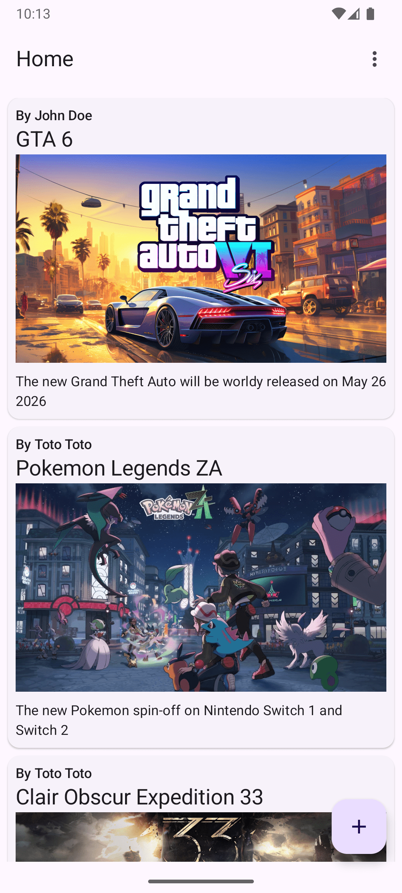
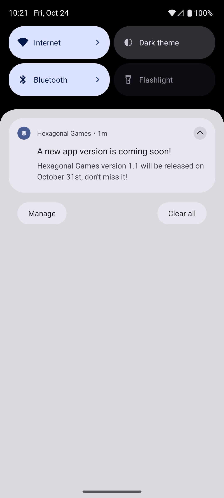
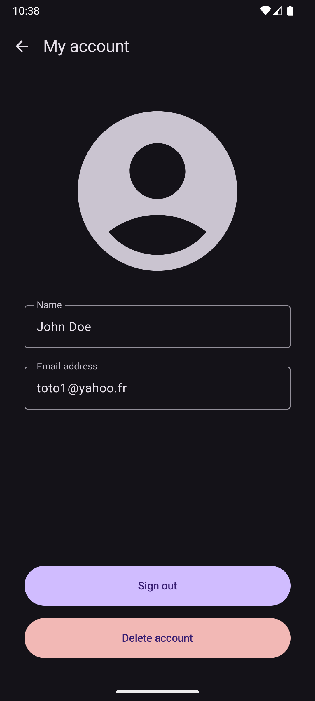

<div align="center">
<br />

</div>

# 🎮 HexagonalGames - Gaming-related posts App

**Hexagonal Games** is a modern Android application built with **Jetpack Compose**, **MVVM architecture**, and **Clean Architecture principles**.  
It allows users to explore, create, and interact with gaming-related posts in a clean, reactive UI.

---

<div align="center">
   
   
   
   
   
    
   
</div>


## 🚀 Features

- 📰 Browse gaming posts in a dynamic home feed
- ✍️ Create new posts with title, description, and image upload
- 💬 Add and view comments on each post in real time
- 👤 View author profiles with display name and email integration
- ❤️ Like and interact with other users’ posts (planned feature)
- 🔄 Pull-to-refresh for live data updates
- ☁️ Firebase Firestore for post and comment storage
- 🔐 Firebase Authentication for secure user login and account management
- ⚙️ Edit app settings and manage personal preferences
- 🧭 Smooth navigation between screens using Compose Navigation
- 🌙 Modern Material 3 theming with dynamic light/dark mode

---

## 🧱 Architecture & Technologies

The project follows a **layered MVVM + Clean Architecture** approach:

- **UI Layer (Compose Screens)** → displays data and listens to UI states.
- **ViewModel Layer** → handles logic, exposes `StateFlow` to UI.
- **Repository Layer** → abstracts data operations (Firestore, local, etc.).
- **Service Layer** → provides access to Firebase or remote APIs.
- **Dependency Injection (Hilt)** → manages object creation and scoping.

---

## 📂 Project Structure

```
com.hexagonal.games
│
├── data
│   ├── repository        # Handles data sources and business logic
│   └── service           # Defines API interfaces and Firebase/Firestore services
│
├── di
│   ├── AppModule.kt      # Hilt module for dependency injection
│   └── DataStoreModule.kt# Provides DataStore preferences
│
├── domain.model
│   ├── Comment.kt        # Domain model for comments
│   ├── Post.kt           # Domain model for posts
│   └── User.kt           # Domain model for users
│
├── screen
│   ├── addComment        # UI & ViewModel for adding comments
│   ├── addPost           # UI & ViewModel for creating posts
│   ├── detailPost        # UI & ViewModel for viewing post details
│   ├── homefeed          # UI & ViewModel for home feed posts
│   ├── profile           # UI & ViewModel for user profile
│   ├── settings          # UI & ViewModel for app settings
│   └── Screen.kt         # Defines navigation destinations
│
├── ui
│   └── ...               # Theming, typography, and reusable Compose components
│
└── HexagonalGamesApplication.kt # Application entry point
```

---

## 🧪 Testing Strategy

The project includes **unit tests** to ensure reliable and predictable behavior.

**Testing tools used:**
- [MockK](https://mockk.io/) → for mocking dependencies
- [Turbine](https://github.com/cashapp/turbine) → for testing Kotlin Flows
- [JUnit5](https://junit.org/junit5/) → for unit test structure

---

## 📸 Screenshots

<p align="center">
  
  
  
  
  
  
  
  
  
  
</p>

## 📲 Installation

1. Clone this repository:
   ```bash
   git clone https://github.com/arnoagape/hexagonalgames.git
   ```
2. Open in **Android Studio**
3. Sync Gradle and run the app on your emulator or physical device

---

## 🙌 Author

Made with passion for Android development by Arno